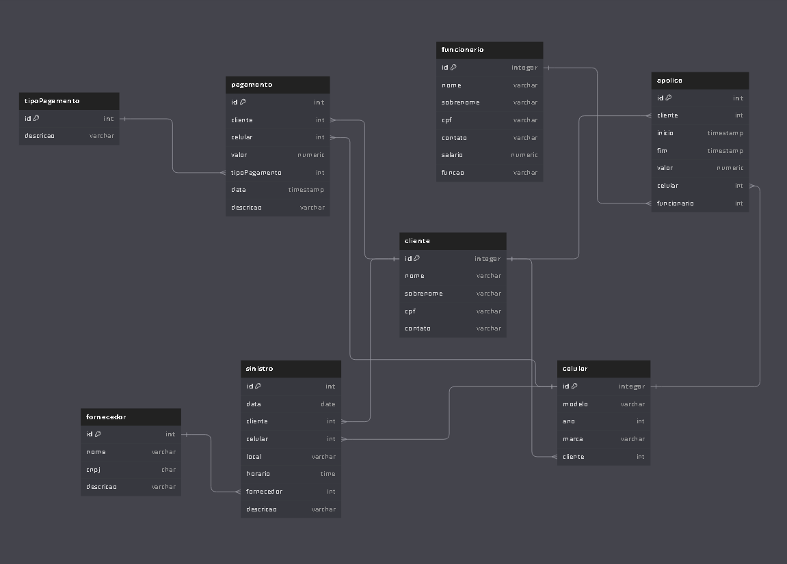

## Projeto Sistema de Atividades Especiais - GRUPO A

### Integrantes
Luiz Felipe Zomer - @LuizZomer 
Luiz Filipe Linhares - @LuizFilipeLinhares 
Willian Minatto - @willianminatto 
Daniel Freitas - @DanielFreitassc 
Augustos Preis - @AugustoPreis
...

### Modelo Físico
Utilizamos a ferramenta de modelagem de dados [dbdiagram.io](https://dbdiagram.io/) para criação do modelo físico do banco de dados, para posterior exportação dos scripts DDL das tabelas e relacionamentos. 
Arquivo fonte: [Modelo Fisico](https://dbdiagram.io/d/6660f7fe8f6e135d4a671308). 

  
### Dicionário de Dados
As informações sobre as tabelas e índices foram documentados na planilha [template1.xlsx](dicionario_dados/template1.xlsx).

### Scripts SQL
Para este projeto foi utilizado o banco de dados [Azure SQL](https://azure.microsoft.com/pt-br/products/azure-sql/database)  
Este é o procedimento para criação do banco de dados Azure SQL [Criando SQL Azure serverless no Azure gratuito - Sem cartão de crédito](https://github.com/jlsilva01/sql-azure-satc).

Abaixo, segue os scripts SQL separados por tipo:
+ DDL [ddl.sql](scripts_sql/ddl.sql)
+ Índices [indices.sql](scripts_sql/indices.sql)
+ DML [dml.sql](scripts_sql/dml.sql)
+ Triggers [triggers.sql](scripts_sql/triggers.sql)
+ Stored Procedures [stored_procedures.sql](scripts_sql/stored_procedures.sql)
+ Functions [functions.sql](scripts_sql/functions.sql)

### Código Fonte do CRUD
- Linguagem de Programação C# .NET. 
- Framework .NET 4.6
- Projeto Windows Forms
- Biblioteca Entity Framework para SQL Server (nativo)

[Codigo Fonte](fonte/)

### Relatório Final
O relatório final está disponível no arquivo [template1.docx](relatorio/template1.docx).
